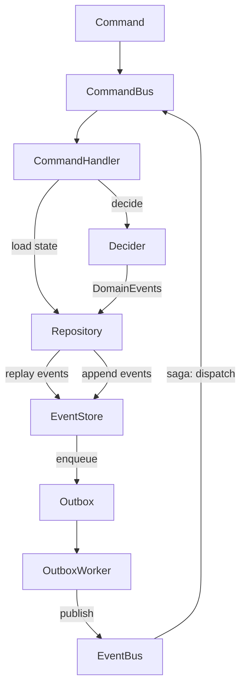
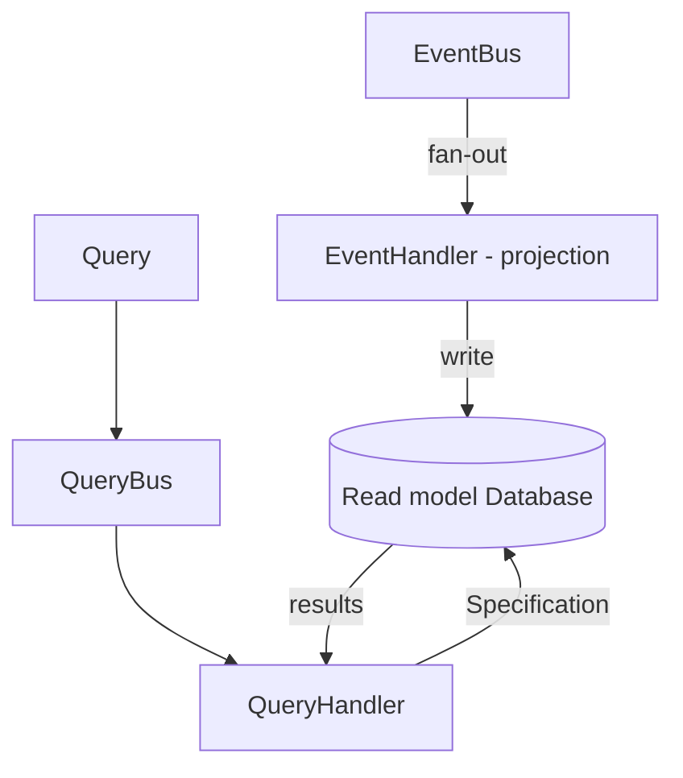

# @arts-and-crafts

> Arts and Crafts was a reaction against the industrialization and excess of the Victorian era, and it sought to celebrate traditional craftsmanship and materials. Arts and Crafts architecture is characterized by a simple and functional design, the use of natural materials, and a focus on craftsmanship.

## Why

To provide structure and organization to your codebase, making it easier to understand (maintainable), test (testable), adapt (flexible), scale (scalable) and withstand failure (robust).

### Simplicity

The idea here is that a web application (hereafter, a system) has three types of entrypoints. The actor could be a producer making a POST request (a command), or a consumer retrieving data via a GET request (a query). The actor could also be a publisher sending a message (an event). To summarize, the entrypoints are:
- Commands;
- Queries, and
- Events.

### Usecases

Based on the idea of a system consisting of only having to handle commands, queries and events, we can provide a clear separation of concerns. This allows us to focus on each type of entrypoint independently, making it easier to reason about and maintain the codebase.

So, each entrypoint is a separate usecase. Thus, in a organized and structured system, each usecase is independent of other usecases (decoupled) and the usecase itself should contain all its required logic.

### Modularity

Modularity is a key principle in software development. It involves breaking down a system into smaller, independent modules that can be developed, tested, and maintained separately.

Usecases belong to a specific domain. Domains are organized as separate modules, each responsible for a specific aspect of the system, often also with their own terminology and domain-specific language.

Domains consist of behavior (usecases). These usecases could be part of a workflow. Workflows could cross multiple domains.

### Workflows

Workflows are a way to organize usecases into a sequence of steps. Each step in a workflow is a usecase. Workflows can be used to model complex business processes.

### System design

The recommended approach to designing features is **Event Storming**: start by identifying the domain events that matter (facts that already happened), then work backwards to find the commands that caused them and the queries that read from their projections. This surfaces the natural boundaries between usecases and bounded contexts before any code is written.

Once events are identified, each feature becomes a vertical slice:

1. A **command** triggers a **CommandHandler** that loads state, runs a **Decider**, and appends **DomainEvents** to the **EventStore**.
2. The **EventStore** enqueues each event to the **Outbox** at write time, decoupling persistence from publishing.
3. The **OutboxWorker** drains the **Outbox** and publishes to the **EventBus**, which fans out to **EventHandlers**.
4. **EventHandlers** either update a read-model **Database** (projection) or dispatch follow-up commands (saga / ACL).
5. A **query** triggers a **QueryHandler** that reads the projected **Database** using a **Specification**.

## Installation

This package is available on npm as `@arts-n-crafts/ts`. It ships two versioned entry points:

```bash
# Install
bun add @arts-n-crafts/ts
# or
npm install @arts-n-crafts/ts
```

```typescript
// v4 (recommended)
import { ... } from '@arts-n-crafts/ts/v4'

// v3 (legacy)
import { ... } from '@arts-n-crafts/ts/v3'

// or the default (v3)
import { ... } from '@arts-n-crafts/ts'
```

## Contributing

This codebase is written in TypeScript and uses Bun as the runtime.

```bash
bun install          # Install dependencies
bun run build        # Build all packages
bun run lint         # Lint all packages
bun run lint:fix     # Auto-fix lint issues
bun run typecheck    # Type-check all packages
bun run coverage     # Run tests with coverage
bun run check-exports  # Validate package exports
```

To work on a single package:

```bash
cd packages/v4
bun run test         # Run tests once
bun run test:watch   # Run tests in watch mode
bun run build        # Build this package only
```

Commits follow the [Conventional Commits](https://www.conventionalcommits.org/) spec. Use `bun run commit` for an interactive prompt.

This project was created using `bun init` in bun v1.2.0. [Bun](https://bun.sh) is a fast all-in-one JavaScript runtime.

---

## Concepts (v4)

All concept documentation lives co-located with the source in `docs/` subfolders per layer.

### Utils

| Concept | Description |
|---------|-------------|
| [fail](packages/v4/src/utils/fail/docs/fail.md) | Wraps a value in a thunk for lazy error creation |
| [invariant](packages/v4/src/utils/invariant/docs/invariant.md) | Asserts a condition and throws if false |
| [isEqual](packages/v4/src/utils/isEqual/docs/isEqual.md) | Deep structural equality check |
| [parseAsError](packages/v4/src/utils/parseAsError/docs/parseAsError.md) | Normalises unknown catch values to `Error` |
| [StreamKey](packages/v4/src/utils/streamKey/docs/StreamKey.md) | Composite `${streamName}#${aggregateId}` key type |

### Core — types

| Concept | Description |
|---------|-------------|
| [BaseMetadata](packages/v4/src/core/docs/types/BaseMetadata.md) | Shared metadata for all message types |
| [ISODateTime](packages/v4/src/core/docs/types/ISODateTime.md) | ISO 8601 date-time string brand |
| [UnixTimestamp](packages/v4/src/core/docs/types/UnixTimestamp.md) | Epoch milliseconds number brand |
| [WithIdentifier](packages/v4/src/core/docs/types/WithIdentifier.md) | `{ id: string }` constraint |
| [FilledArray](packages/v4/src/core/docs/types/FilledArray.md) | Non-empty array type |
| [Maybe](packages/v4/src/core/docs/types/Maybe.md) | `T \| undefined` |
| [Nullable](packages/v4/src/core/docs/types/Nullable.md) | `T \| null` |
| [Primitive](packages/v4/src/core/docs/types/Primitive.md) | Scalar value union |

### Core — CQRS primitives

| Concept | Description |
|---------|-------------|
| [Command](packages/v4/src/core/docs/Command.md) | Write-side intent message |
| [Query](packages/v4/src/core/docs/Query.md) | Read-side data request |
| [createCommand](packages/v4/src/core/docs/createCommand.md) | Factory for `Command` objects |
| [isCommand](packages/v4/src/core/docs/isCommand.md) | Type guard for `Command` |
| [createQuery](packages/v4/src/core/docs/createQuery.md) | Factory for `Query` objects |
| [isQuery](packages/v4/src/core/docs/isQuery.md) | Type guard for `Query` |
| [getTimestamp](packages/v4/src/core/docs/getTimestamp.md) | Current epoch milliseconds |

### Core — handlers

| Concept | Description |
|---------|-------------|
| [CommandHandler](packages/v4/src/core/docs/CommandHandler.md) | Application-layer write handler |
| [QueryHandler](packages/v4/src/core/docs/QueryHandler.md) | Application-layer read handler |
| [EventHandler](packages/v4/src/core/docs/EventHandler.md) | Projection or ACL reaction handler |

### Domain — events

| Concept | Description |
|---------|-------------|
| [DomainEvent](packages/v4/src/domain/docs/DomainEvent.md) | Internal fact produced by a `Decider` |
| [Rejection](packages/v4/src/domain/docs/Rejection.md) | Explicit command failure |
| [createDomainEvent](packages/v4/src/domain/docs/createDomainEvent.md) | Factory for `DomainEvent` |
| [isDomainEvent](packages/v4/src/domain/docs/isDomainEvent.md) | Type guard for `DomainEvent` |
| [isEvent](packages/v4/src/domain/docs/isEvent.md) | Broad structural guard for any event shape |
| [createRejection](packages/v4/src/domain/docs/createRejection.md) | Factory for `Rejection` |
| [isRejection](packages/v4/src/domain/docs/isRejection.md) | Type guard for `Rejection` |
| [convertDomainEventToIntegrationEvent](packages/v4/src/domain/docs/convertDomainEventToIntegrationEvent.md) | Converts an internal event to the external wire format |
| [convertRejectionToIntegrationEvent](packages/v4/src/domain/docs/convertRejectionToIntegrationEvent.md) | Converts a rejection to the external wire format |

### Domain — building blocks

| Concept | Description |
|---------|-------------|
| [AggregateRoot](packages/v4/src/domain/docs/AggregateRoot.md) | OOP aggregate base class |
| [Decider](packages/v4/src/domain/docs/Decider.md) | Functional event-sourcing: `decide` + `evolve` + `initialState` |
| [Repository](packages/v4/src/domain/docs/Repository.md) | Domain output port for loading and storing aggregates |
| [Specification](packages/v4/src/domain/docs/Specification.md) | Composable query predicates with `.and()/.or()/.not()` |

### Infrastructure — event types

| Concept | Description |
|---------|-------------|
| [IntegrationEvent](packages/v4/src/infrastructure/docs/IntegrationEvent.md) | External wire format for outbound events |
| [ExternalEvent](packages/v4/src/infrastructure/docs/ExternalEvent.md) | Inbound event from another bounded context |
| [createIntegrationEvent](packages/v4/src/infrastructure/docs/createIntegrationEvent.md) | Factory for `IntegrationEvent` |
| [isIntegrationEvent](packages/v4/src/infrastructure/docs/isIntegrationEvent.md) | Type guard for `IntegrationEvent` |
| [createExternalEvent](packages/v4/src/infrastructure/docs/createExternalEvent.md) | Factory for `ExternalEvent` |
| [isExternalEvent](packages/v4/src/infrastructure/docs/isExternalEvent.md) | Type guard for `ExternalEvent` |

### Infrastructure — interfaces

| Concept | Description |
|---------|-------------|
| [CommandBus](packages/v4/src/infrastructure/docs/CommandBus.md) | Routes commands to registered handlers |
| [QueryBus](packages/v4/src/infrastructure/docs/QueryBus.md) | Routes queries to registered handlers |
| [EventBus](packages/v4/src/infrastructure/docs/EventBus.md) | Publishes and consumes events across streams |
| [EventStore](packages/v4/src/infrastructure/docs/EventStore.md) | Append-only event ledger |
| [StoredEvent](packages/v4/src/infrastructure/docs/StoredEvent.md) | Persistence envelope for a `DomainEvent` |
| [Database](packages/v4/src/infrastructure/docs/Database.md) | Generic record storage with typed operations |
| [Outbox](packages/v4/src/infrastructure/docs/Outbox.md) | At-least-once delivery buffer |
| [OutboxEntry](packages/v4/src/infrastructure/docs/OutboxEntry.md) | A single buffered `IntegrationEvent` with delivery state |
| [OutboxWorker](packages/v4/src/infrastructure/docs/OutboxWorker.md) | Drains the outbox and publishes to the `EventBus` |

### Infrastructure — implementations

| Concept | Simple | Resulted |
|---------|--------|---------|
| CommandBus | [SimpleCommandBus](packages/v4/src/infrastructure/docs/SimpleCommandBus.md) | [ResultedCommandBus](packages/v4/src/infrastructure/docs/ResultedCommandBus.md) |
| QueryBus | [SimpleQueryBus](packages/v4/src/infrastructure/docs/SimpleQueryBus.md) | [ResultedQueryBus](packages/v4/src/infrastructure/docs/ResultedQueryBus.md) |
| EventBus | [SimpleEventBus](packages/v4/src/infrastructure/docs/SimpleEventBus.md) | [ResultedEventBus](packages/v4/src/infrastructure/docs/ResultedEventBus.md) |
| EventStore | [SimpleEventStore](packages/v4/src/infrastructure/docs/SimpleEventStore.md) | [ResultedEventStore](packages/v4/src/infrastructure/docs/ResultedEventStore.md) |
| Database | [SimpleDatabase](packages/v4/src/infrastructure/docs/SimpleDatabase.md) | [ResultedDatabase](packages/v4/src/infrastructure/docs/ResultedDatabase.md) |
| Repository | [SimpleRepository](packages/v4/src/infrastructure/docs/SimpleRepository.md) | [ResultedRepository](packages/v4/src/infrastructure/docs/ResultedRepository.md) |
| Outbox | [InMemoryOutbox](packages/v4/src/infrastructure/docs/InMemoryOutbox.md) | — |
| OutboxWorker | [GenericOutboxWorker](packages/v4/src/infrastructure/docs/GenericOutboxWorker.md) | — |

### Integration point

| Concept | Description |
|---------|-------------|
| [ScenarioTest](packages/v4/src/infrastructure/docs/ScenarioTest.md) | BDD-style `given().when().then()` test harness |

---

## How to build features

### Write path

A command enters the system, is handled, and its resulting domain events are published via the Outbox to the EventBus. A saga handler can loop back and dispatch further commands.



1. A `Command` is dispatched to the `CommandBus`, which routes it to the registered `CommandHandler`.
2. The `CommandHandler` calls `Repository.load` to replay the aggregate's `DomainEvent[]` through `Decider.evolve`, reconstructing current state.
3. `Decider.decide(command, state)` produces new `DomainEvent[]` (or a `Rejection`).
4. `Repository.store` calls `EventStore.append`, which persists the events and immediately enqueues each to the `Outbox`.
5. The `OutboxWorker` polls the `Outbox` on each tick and publishes pending entries to the `EventBus` — giving at-least-once delivery even if publishing fails transiently.
6. A saga `EventHandler` can receive the published event and dispatch a follow-up `Command` back to the `CommandBus`, chaining usecases across bounded contexts.

### Projection and read path

An EventHandler projects domain events into a read-model Database. Queries read directly from that projection.



1. The `EventBus` fans out each published event to all subscribed `EventHandler` instances on the stream.
2. A projection `EventHandler` receives the event and writes a denormalised record to a read-model `Database`.
3. A `Query` is dispatched to the `QueryBus`, which routes it to the registered `QueryHandler`.
4. The `QueryHandler` queries the read-model `Database` using a `Specification`, returning the projected records directly.

---

## Architecture principles

| Principle | Embodied by |
|-----------|-------------|
| **Hexagonal / Ports & Adapters** | `CommandBus`, `QueryBus`, `EventBus`, `EventStore`, `Database`, `Repository` are ports; `Simple*` / `Resulted*` are adapters |
| **Clean Architecture** | `core` → `domain` → `infrastructure` dependency direction; domain never imports infrastructure |
| **Vertical Slices** | Each `CommandHandler` / `QueryHandler` owns its full slice: data access, logic, and output |
| **sans-I/O** | `Decider`, `Specification`, `AggregateRoot` contain zero I/O; all side effects are injected |
| **CQRS** | `Command` / `CommandHandler` / `CommandBus` are fully separate from `Query` / `QueryHandler` / `QueryBus` |
| **Event Sourcing** | `Decider` + `EventStore` + `Repository` reconstruct state by replaying `DomainEvent[]` |
| **ISP (SOLID)** | `EventBus` is split into `EventProducer` and `EventConsumer`; `Database` into `Executable` and `QueryAble` |
| **OCP (SOLID)** | `CommandBus` / `QueryBus` register handlers without modifying the bus itself |
