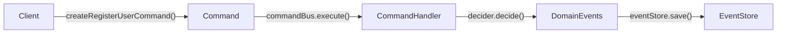

# Command

> An immutable message that expresses intent to change the state of an aggregate.

## What it is

A `Command` is the write-side primitive in **CQRS**. It represents a request to
do something — "CreateUser", "ActivateUser", "UpdateUserName" — directed at a
specific aggregate. Commands are always named in the imperative tense and carry
exactly the data needed to fulfil the intent.

Several architectural principles converge on this type:

- **CQRS**: Commands are strictly separated from queries. A command changes
  state and returns nothing (or a minimal acknowledgement); it never returns
  domain data.
- **DDD**: Commands target a specific aggregate, identified by `aggregateId`
  and `aggregateType`. The aggregate is the consistency boundary responsible
  for deciding whether the command is valid.
- **Hexagonal / clean architecture**: The `Command` interface is a *port* — a
  plain data object defined in the core layer that the application layer
  receives from the outside world (HTTP, CLI, message broker) and hands to the
  domain layer for processing. No framework or I/O dependency leaks in.
- **Vertical slices**: Each command corresponds to one use case. A slice is
  complete when it has a `Command`, a [`CommandHandler`](./CommandHandler.md),
  and domain logic that processes it.

Commands are constructed via [`createCommand`](./createCommand.md), which
freezes the object and stamps it with an `id`, `timestamp`, and
`kind: 'command'` discriminator.

## Interface

```typescript
export interface CommandMetadata extends BaseMetadata {}

export interface Command<TType = string, TPayload = unknown> extends WithIdentifier {
  id: string
  type: TType
  aggregateType?: string
  aggregateId?: string
  payload: TPayload
  timestamp: number
  expectedVersion?: number
  metadata?: Partial<CommandMetadata>
  kind: 'command'
}
```

## Usage

Define a typed command (from `examples/CreateUser.ts`):

```typescript
import type { Command, CommandMetadata } from '@core/Command.ts'
import { createCommand } from '@core/utils/createCommand.ts'

export interface CreateUserProps {
  name: string
  email: string
}

export function createRegisterUserCommand(
  aggregateId: string,
  payload: CreateUserProps,
  metadata?: Partial<CommandMetadata>,
): Command<'CreateUser', CreateUserProps> {
  return createCommand('CreateUser', aggregateId, 'User', payload, metadata)
}

export type RegisterUserCommand = ReturnType<typeof createRegisterUserCommand>
```

## Diagram



## Related

- **Examples**: [`CreateUser.ts`](../examples/CreateUser.ts),
  [`ActivateUser.ts`](../examples/ActivateUser.ts),
  [`UpdateUserName.ts`](../examples/UpdateUserName.ts)
- **Tests**: [`Command.spec.ts`](../Command.spec.ts)
- **Utils**: [`createCommand`](./createCommand.md), [`isCommand`](./isCommand.md)
- **Used by**: [`CommandHandler`](./CommandHandler.md),
  [`CommandBus`](../../infrastructure/docs/CommandBus.md),
  [`Decider`](../../domain/docs/Decider.md),
  [`ScenarioTest`](../../infrastructure/docs/ScenarioTest.md)
