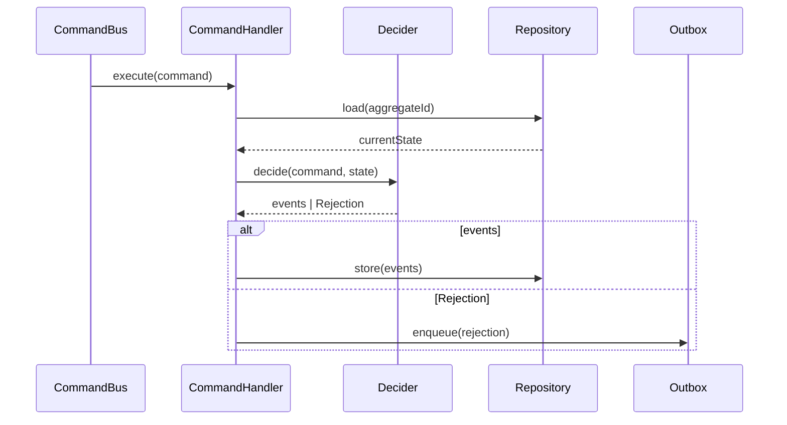

# CommandHandler

> The contract for the application layer object that processes a command and produces side effects.

## What it is

`CommandHandler` is the thin application-layer interface that sits between the
[`CommandBus`](../../infrastructure/docs/CommandBus.md) and the domain. It
receives one specific [`Command`](./Command.md) type, orchestrates domain and
infrastructure calls, and returns a result — by default `Promise<void>`, but
configurable via the `TReturnType` parameter.

In a **CQRS** architecture, the command handler is the entry point for every
write operation. It is responsible for:

1. Loading current state from the [`Repository`](../../domain/docs/Repository.md)
2. Calling the [`Decider`](../../domain/docs/Decider.md) (or aggregate method)
   to apply business rules and produce events or a rejection
3. Persisting events to the [`EventStore`](../../infrastructure/docs/EventStore.md)
   via the repository, or routing a [`Rejection`](../../domain/docs/Rejection.md)
   to the [`Outbox`](../../infrastructure/docs/Outbox.md)

The handler itself contains *no business logic* — all decisions live in the
pure `decide()` function. This is the **Thin Application Layer** pattern: the
handler is pure coordination, the domain is pure logic. It is also the
**sans-I/O** boundary: the domain `Decider` is free of I/O; the handler is
where I/O (loading state, saving events, enqueuing to the Outbox) occurs.

Implementing `CommandHandler<TCommand>` makes the handler's contract explicit
and allows the `CommandBus` to register and dispatch it by command type. This
follows the **SOLID** Open/Closed Principle — adding a new command means adding
a new handler class, not modifying existing routing logic.

## Interface

```typescript
export interface CommandHandler<CommandType extends Command, TReturnType = Promise<void>> {
  execute(aCommand: CommandType): TReturnType
}
```

## Usage

A complete command handler (from `examples/CreateUserHandler.ts`):

```typescript
import type { CommandHandler } from '@core/CommandHandler.ts'
import type { RegisterUserCommand } from '@core/examples/CreateUser.ts'
import type { UserEvent, UserState } from '@domain/examples/User.ts'
import type { Repository } from '@domain/Repository.ts'
import type { Outbox } from '@infrastructure/Outbox/Outbox.ts'
import { User } from '@domain/examples/User.ts'
import { isRejection } from '@domain/utils/isRejection.ts'

export class CreateUserHandler implements CommandHandler<RegisterUserCommand> {
  constructor(
    private readonly repository: Repository<UserEvent, Promise<UserState>, Promise<void>>,
    private readonly outbox: Outbox,
  ) {}

  async execute(aCommand: RegisterUserCommand): Promise<void> {
    const currentState = await this.repository.load(aCommand.aggregateId as string)
    const decision = User.decide(aCommand, currentState)
    if (!isRejection(decision)) {
      return this.repository.store(decision)
    }
    await this.outbox.enqueue(decision)
  }
}
```

Registered on the `CommandBus`:

```typescript
commandBus.register('RegisterUser', new CreateUserHandler(repository, outbox))
```

## Diagram



## Related

- **Examples**: [`CreateUserHandler.ts`](../examples/CreateUserHandler.ts),
  [`UpdateUserNameHandler.ts`](../examples/UpdateUserNameHandler.ts),
  [`ActivateUserHandler.ts`](../examples/ActivateUserHandler.ts)
- **Tests**: [`CommandHandler.spec.ts`](../CommandHandler.spec.ts)
- **Used by**: [`CommandBus`](../../infrastructure/docs/CommandBus.md),
  [`ScenarioTest`](../../infrastructure/docs/ScenarioTest.md)
- **Contrast with**: [`QueryHandler`](./QueryHandler.md),
  [`EventHandler`](./EventHandler.md)
