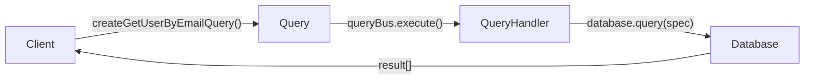

# Query

> An immutable message that expresses intent to read data without changing state.

## What it is

A `Query` is the read-side primitive in **CQRS**. It represents a request to
retrieve data — "GetUserByEmail", "ListOrders", "FindProductsByCategory" —
described by a payload of filter or search criteria. Unlike a
[`Command`](./Command.md), a query targets no specific aggregate and has no
side effects: it only observes, never mutates.

Key architectural roles:

- **CQRS**: The query side is completely separate from the command side. Query
  handlers read from whatever read model or database is optimised for querying
  (a projection, a search index, a denormalised table), independent of the
  event-sourced write model.
- **Hexagonal / clean architecture**: `Query` is a *port* on the read side —
  a plain data object defined in the core layer, free of any I/O or framework
  dependency. The [`QueryBus`](../../infrastructure/docs/QueryBus.md) routes it
  to the appropriate [`QueryHandler`](./QueryHandler.md), which performs the
  actual data access.
- **Vertical slices**: Each query type corresponds to one read use case. A
  slice is complete when it has a `Query`, a `QueryHandler`, and a read model
  or [`Database`](../../infrastructure/docs/Database.md) it queries.
- **SOLID** (Interface Segregation): Queries and commands are distinct
  interfaces — nothing that only reads needs to know about the command
  infrastructure, and vice versa.

Queries are constructed via [`createQuery`](./createQuery.md), which freezes
the object and stamps it with an `id`, `timestamp`, and `kind: 'query'`
discriminator.

## Interface

```typescript
export interface QueryMetadata extends BaseMetadata {}

export interface Query<TType = string, TPayload = unknown> extends WithIdentifier {
  type: TType
  payload: TPayload
  timestamp: number
  metadata: Partial<QueryMetadata>
  kind: 'query'
}
```

## Usage

Define a typed query (from `examples/GetUserByEmail.ts`):

```typescript
import type { Query, QueryMetadata } from '@core/Query.ts'
import { createQuery } from '@core/utils/createQuery.ts'

export interface GetUserByEmailProps {
  email: string
}

export function createGetUserByEmailQuery(
  payload: GetUserByEmailProps,
  metadata?: Partial<QueryMetadata>,
): Query<'GetUserByEmail', GetUserByEmailProps> {
  return createQuery('GetUserByEmail', payload, metadata)
}

export type GetUserByEmail = ReturnType<typeof createGetUserByEmailQuery>
```

The corresponding handler:

```typescript
export class GetUserByEmailHandler
implements QueryHandler<GetUserByEmail, Promise<GetUserByEmailResult[]>> {
  constructor(private readonly database: Database<WithIdentifier<UserCreatedPayload>, Promise<void>, Promise<WithIdentifier<UserCreatedPayload>[]>>) {}

  async execute(query: GetUserByEmail): Promise<GetUserByEmailResult[]> {
    const spec = new FieldEquals('email', query.payload.email)
    return this.database.query('users', spec)
  }
}
```

## Diagram



## Related

- **Examples**: [`GetUserByEmail.ts`](../examples/GetUserByEmail.ts),
  [`GetUserByEmailHandler.ts`](../examples/GetUserByEmailHandler.ts)
- **Tests**: [`Query.spec.ts`](../Query.spec.ts)
- **Utils**: [`createQuery`](./createQuery.md), [`isQuery`](./isQuery.md)
- **Used by**: [`QueryHandler`](./QueryHandler.md),
  [`QueryBus`](../../infrastructure/docs/QueryBus.md),
  [`ScenarioTest`](../../infrastructure/docs/ScenarioTest.md)
