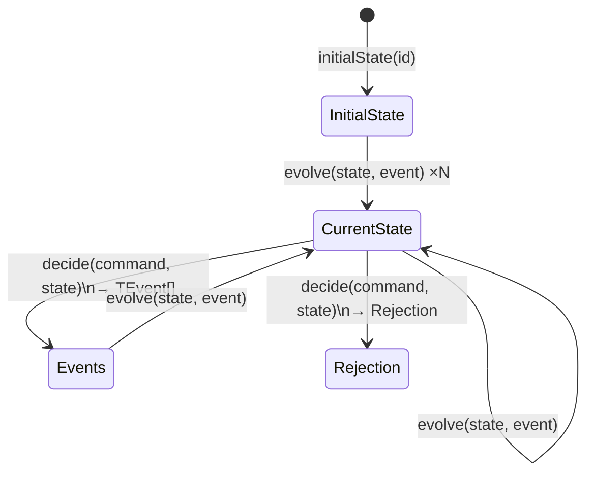

# Decider

> The functional alternative to AggregateRoot — pure functions that decide events and evolve state.

## What it is

`Decider` is the library's functional event-sourcing primitive. Instead of an
OOP class with mutable state and an internal outbox, a `Decider` is a plain
object holding three pure functions:

- **`decide(command, currentState) → TEvent[] | Rejection`** — applies business
  rules to a command and returns either the events that should be recorded, an
  empty array (no-op), or a [`Rejection`](./Rejection.md) if a business rule
  is violated.
- **`evolve(currentState, event) → TState`** — folds a single event into the
  current state to produce the next state. Replaying all past events through
  `evolve` from `initialState` always produces the same current state —
  deterministic and side-effect-free.
- **`initialState(id) → TState`** — produces the zero state for a new aggregate,
  given its id.

The `this: void` annotation on all three functions enforces that they have no
`this` context — they are truly pure functions, not methods. This is the
**sans-I/O** principle at its most explicit: domain logic contains no I/O,
no side effects, no dependencies.

This design reflects the **functional core / imperative shell** architecture:
the `Decider` is the pure functional core; the
[`CommandHandler`](../../core/docs/CommandHandler.md) is the imperative shell
that loads state, calls `decide`, and persists results. It also makes testing
trivial — no mocks, no setup, just `decide(command, state)` and assert on
the result.

`Decider` is the preferred pattern for new aggregates. The OOP
[`AggregateRoot`](./AggregateRoot.md) pattern is also supported for teams that
prefer class-based domain modeling.

## Interface

```typescript
export interface Decider<TState, TCommand, TEvent extends DomainEvent> {
  decide(this: void, command: TCommand, currentState: TState): TEvent[] | Rejection
  evolve(this: void, currentState: TState, event: TEvent): TState
  initialState(this: void, id: string): TState
}
```

## Usage

A complete `Decider` (from `examples/User.ts`):

```typescript
import type { Decider } from '@domain/Decider.ts'

export const User: Decider<UserState, UserCommand, UserEvent> = {
  initialState: id => ({ id, name: '', email: '', prospect: true }),

  evolve: (currentState, event) => {
    switch (event.type) {
      case 'UserCreated':
        return { ...currentState, ...event.payload }
      case 'UserNameUpdated':
        return { ...currentState, name: event.payload.name }
      case 'UserActivated':
        return { ...currentState, prospect: false }
      default:
        return currentState
    }
  },

  decide: (command, currentState) => {
    switch (command.type) {
      case 'CreateUser': {
        if (currentState.name !== '') {
          return {
            id: command.id,
            type: 'CreateUserRejected',
            kind: 'rejection',
            commandId: command.id,
            commandType: command.type,
            reasonCode: 'ALREADY_EXISTS',
            classification: 'business',
            retryable: false,
            timestamp: command.timestamp,
          }
        }
        return [createUserCreatedEvent(command.aggregateId, command.payload)]
      }
      case 'UpdateUserName': {
        if (currentState.name === command.payload.name)
          return []
        return [createUserNameUpdatedEvent(command.aggregateId, command.payload)]
      }
    }
  },
}
```

Reconstructing state and deciding in a test (no mocks needed):

```typescript
const pastEvents = [userCreatedEvent]
const currentState = pastEvents.reduce(User.evolve, User.initialState(aggregateId))
const decision = User.decide(updateNameCommand, currentState)
// decision is UserEvent[] or Rejection — plain values, fully assertable
```

## Diagram



## Related

- **Examples**: [`User.ts`](../examples/User.ts)
- **Tests**: [`User.spec.ts`](../examples/User.spec.ts)
- **Used by**: [`Repository`](./Repository.md),
  [`CommandHandler`](../../core/docs/CommandHandler.md),
  [`ScenarioTest`](../../infrastructure/docs/ScenarioTest.md)
- **Contrast with**: [`AggregateRoot`](./AggregateRoot.md) (OOP alternative)
