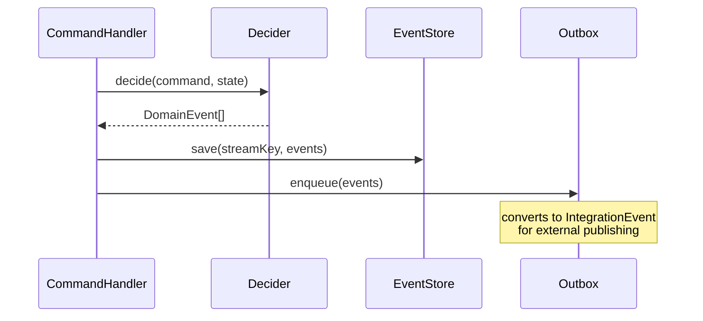

# DomainEvent

> An immutable fact that records a state change that has already occurred within an aggregate.

## What it is

A `DomainEvent` is the fundamental unit of truth in **Event Sourcing**. It
represents something that *happened* — not a request to do something (that's a
[`Command`](../../core/docs/Command.md)) and not a refusal to act (that's a
[`Rejection`](./Rejection.md)). Examples: `UserCreated`, `OrderShipped`,
`PaymentProcessed`.

Three properties make domain events central to this library's design:

**They are facts, not intentions.** A domain event records what the aggregate
*decided* happened, after the [`Decider`](./Decider.md) applied business rules
to the incoming command. The event stream is the aggregate's history — replaying
it from scratch always produces the same current state.

**They are internal to the bounded context.** A `DomainEvent` has `kind: 'domain'`
and stays within the service that owns the aggregate. It is never published
directly to external consumers. To notify other services, convert it to an
[`IntegrationEvent`](../../infrastructure/docs/IntegrationEvent.md) via the
[`Outbox`](../../infrastructure/docs/Outbox.md). This boundary is a **DDD**
(Bounded Context) and **hexagonal architecture** (don't let domain objects leak
out of the port) concern — see
[ADR-001](../../../../docs/adr/001-rejection-is-not-a-domain-event.md) for
the full rationale.

**They are append-only and immutable.** Once written to the
[`EventStore`](../../infrastructure/docs/EventStore.md), a domain event is
never modified or deleted. The event store is the single source of truth for
*what happened*.

`DomainEventMetadata` extends [`BaseMetadata`](../../core/docs/types/BaseMetadata.md)
with `commandId` and `commandType` to maintain a causal link back to the
command that triggered the event — essential for distributed tracing and audit.

## Interface

```typescript
export interface DomainEventMetadata extends BaseMetadata {
  commandId?: string
  commandType?: string
}

export interface DomainEvent<TPayload = unknown> {
  id: string
  type: string
  aggregateType: string
  aggregateId: string
  payload: TPayload
  timestamp: number
  metadata: Partial<DomainEventMetadata>
  kind: 'domain'
}
```

## Usage

Define a typed domain event (from `examples/UserCreated.ts`):

```typescript
import type { DomainEvent, DomainEventMetadata } from '@domain/DomainEvent.ts'
import { createDomainEvent } from '@domain/utils/createDomainEvent.ts'

export interface UserCreatedPayload {
  name: string
  email: string
  age?: number
  prospect: boolean
}

export function createUserCreatedEvent(
  aggregateId: string,
  payload: Omit<UserCreatedPayload, 'prospect'>,
  metadata?: Partial<DomainEventMetadata>,
): DomainEvent<UserCreatedPayload> {
  return createDomainEvent('UserCreated', aggregateId, 'User', { prospect: true, ...payload }, metadata)
}
```

## Diagram



## Related

- **Examples**: [`UserCreated.ts`](../examples/UserCreated.ts),
  [`UserNameUpdated.ts`](../examples/UserNameUpdated.ts)
- **Tests**: [`DomainEvent.spec.ts`](../DomainEvent.spec.ts)
- **Utils**: [`createDomainEvent`](./createDomainEvent.md),
  [`isDomainEvent`](./isDomainEvent.md), [`isEvent`](./isEvent.md)
- **ADR**: [ADR-001 — Rejection is Not a Domain Event](../../../../docs/adr/001-rejection-is-not-a-domain-event.md)
- **Used by**: [`Decider`](./Decider.md), [`EventStore`](../../infrastructure/docs/EventStore.md),
  [`Outbox`](../../infrastructure/docs/Outbox.md),
  [`EventBus`](../../infrastructure/docs/EventBus.md),
  [`ScenarioTest`](../../infrastructure/docs/ScenarioTest.md)
- **Contrast with**: [`Rejection`](./Rejection.md),
  [`IntegrationEvent`](../../infrastructure/docs/IntegrationEvent.md)
