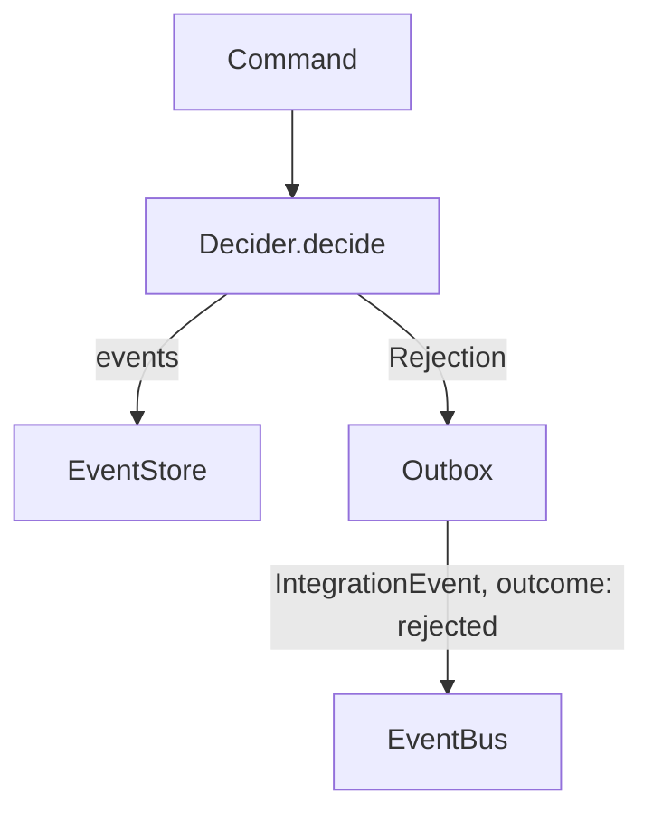

# Rejection

> A value that represents a refused command decision — not an event, not an exception.

## What it is

A `Rejection` is what a [`Decider`](./Decider.md) returns when a command
violates a business rule and no state change should occur. It is the explicit
failure branch of the `TEvent[] | Rejection` union returned by `decide()`.

Understanding what a `Rejection` is *not* is as important as understanding what
it is:

- **Not a [`DomainEvent`](./DomainEvent.md)** — nothing happened; there is no
  fact to record in the event stream. A rejection is never written to the
  [`EventStore`](../../infrastructure/docs/EventStore.md)
  (see [ADR-001](../../../../docs/adr/001-rejection-is-not-a-domain-event.md)).
- **Not an exception** — business rule violations are *expected* outcomes, not
  bugs. Throwing an exception from domain logic breaks purity and makes
  outcomes harder to test. The `TEvent[] | Rejection` return type keeps
  everything as plain values
  (see [ADR-004](../../../../docs/adr/004-decider-returns-rejection-for-business-rule-violations.md)).
- **Not silent** — unlike returning an empty `[]`, a rejection carries rich
  metadata: `reasonCode`, `classification`, `retryable`, `reason`, and optional
  `validationErrors`. Callers can log it, publish it as an
  [`IntegrationEvent`](../../infrastructure/docs/IntegrationEvent.md) with
  `outcome: 'rejected'`, and route it to the right consumer.

In a **DDD / Event Sourcing** model, a rejection records a *refused command*
— the aggregate's decision to stay in its current state. It is persisted via
the [`Outbox`](../../infrastructure/docs/Outbox.md) for at-least-once delivery
to external consumers, not via the event store.

This pattern mirrors `Result<T, E>` from functional programming: `decide()`
returns either a success value (events) or a typed failure (rejection), both
as ordinary values that callers handle with `isRejection()`.

## Interface

```typescript
export interface RejectionMetadata extends BaseMetadata {
  aggregateType?: string
  aggregateId?: string
}

export interface Rejection<TDetails = object> {
  id: string
  type: string
  kind: 'rejection'
  commandId: string
  commandType: string
  reasonCode: string | 'VERSION_CONFLICT' | 'VALIDATION_FAILED'
  reason?: string
  classification?: 'business' | 'validation' | 'concurrency' | 'technical'
  retryable?: boolean
  details?: TDetails
  validationErrors?: Array<{ field?: string, code: string, message?: string }>
  timestamp: number
  metadata?: RejectionMetadata
}
```

## Usage

Inside a `Decider.decide()` function:

```typescript
import type { Rejection } from '@domain/Rejection.ts'
import { isRejection } from '@domain/utils/isRejection.ts'

function decide(command: UserCommand, state: UserState): UserEvent[] | Rejection {
  if (command.type === 'CreateUser') {
    if (state.exists) {
      return {
        id: command.id,
        type: 'CreateUserRejected',
        kind: 'rejection',
        commandId: command.id,
        commandType: command.type,
        reasonCode: 'ALREADY_EXISTS',
        reason: 'User already exists',
        classification: 'business',
        retryable: false,
        timestamp: command.timestamp,
      } satisfies Rejection
    }
    return [createUserCreatedEvent(command.aggregateId, command.payload)]
  }
}
```

Handling the result in a `CommandHandler`:

```typescript
const result = User.decide(command, state)

if (isRejection(result)) {
  await this.outbox.enqueue(result) // publish as IntegrationEvent outcome='rejected'
}
else {
  await this.repository.store(result) // save events to EventStore
}
```

## Diagram



## Related

- **Utils**: [`createRejection`](./createRejection.md),
  [`isRejection`](./isRejection.md)
- **ADR**: [ADR-001 — Rejection is Not a Domain Event](../../../../docs/adr/001-rejection-is-not-a-domain-event.md),
  [ADR-004 — Decider Returns Rejection](../../../../docs/adr/004-decider-returns-rejection-for-business-rule-violations.md)
- **Used by**: [`Decider`](./Decider.md),
  [`Outbox`](../../infrastructure/docs/Outbox.md),
  [`ScenarioTest`](../../infrastructure/docs/ScenarioTest.md)
- **Contrast with**: [`DomainEvent`](./DomainEvent.md),
  [`IntegrationEvent`](../../infrastructure/docs/IntegrationEvent.md)
