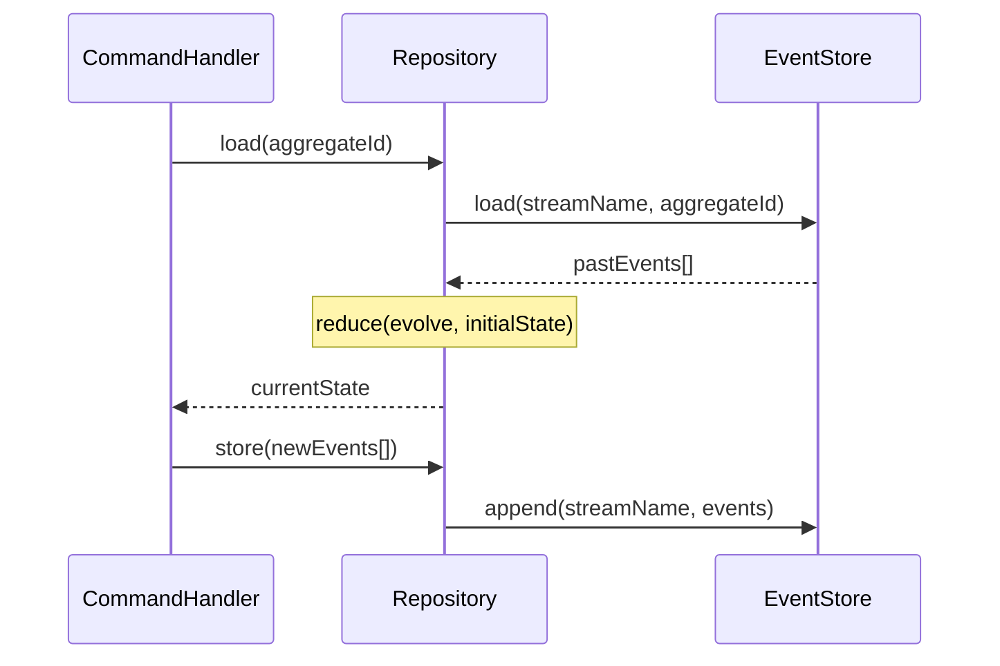

# Repository

> The domain port for loading aggregate state and persisting new events.

## What it is

`Repository` is the domain-layer abstraction over the
[`EventStore`](../../infrastructure/docs/EventStore.md). It exposes exactly two
operations: `load` — reconstruct the current state of an aggregate from its
event history — and `store` — append new events to the stream. The `streamName`
property identifies which event stream the repository manages.

In **hexagonal architecture**, `Repository` is an *output port* defined in the
domain layer. The domain does not import anything from infrastructure; it only
depends on this interface. The infrastructure layer provides the concrete
implementation (`SimpleRepository`, `ResultedRepository`) as a *driven adapter*,
injected into the application layer via the constructor. This keeps the domain
pure and testable in isolation.

In **Event Sourcing**, `load` does not fetch a snapshot — it loads all past
events from the `EventStore` and folds them through the `Decider.evolve`
function (or equivalent OOP rehydration) to arrive at the current state.
`store` appends the new events produced by `decide()` to the stream.

The `Repository` interface is generic over three type parameters:

- `TEvent` — the union of domain event types for this aggregate
- `TLoadReturnType` — the return type of `load` (e.g. `Promise<UserState>`)
- `TStoreReturnType` — the return type of `store` (defaults to `Promise<void>`;
  `ResultedRepository` uses `Promise<Result<void, Error>>`)

This matches the **Simple/Resulted** pattern used throughout the library's
infrastructure layer.

## Interface

```typescript
export interface Repository<TEvent, TLoadReturnType, TStoreReturnType = Promise<void>> {
  readonly streamName: string
  load(aggregateId: string): TLoadReturnType
  store(events: TEvent[]): TStoreReturnType
}
```

## Usage

Constructing a `SimpleRepository` in a command handler or test:

```typescript
import { User } from '@domain/examples/User.ts'
import { SimpleRepository } from '@infrastructure/Repository/implementations/SimpleRepository.ts'

const repository = new SimpleRepository(
  eventStore,
  'users', // streamName
  User.evolve, // fold function: (state, event) => state
  User.initialState, // () => initial state value
)

// In a CommandHandler:
const currentState = await repository.load(command.aggregateId)
const events = User.decide(command, currentState)
await repository.store(events)
```

## Diagram



## Related

- **Implementations**: [`SimpleRepository`](../../infrastructure/docs/SimpleRepository.md),
  [`ResultedRepository`](../../infrastructure/docs/ResultedRepository.md)
- **Tests**: [`SimpleRepository.spec.ts`](../../infrastructure/Repository/implementations/SimpleRepository.spec.ts)
- **Used by**: [`CommandHandler`](../../core/docs/CommandHandler.md),
  [`ScenarioTest`](../../infrastructure/docs/ScenarioTest.md)
- **Contrast with**: [`EventStore`](../../infrastructure/docs/EventStore.md)
  (lower-level; Repository wraps it)
