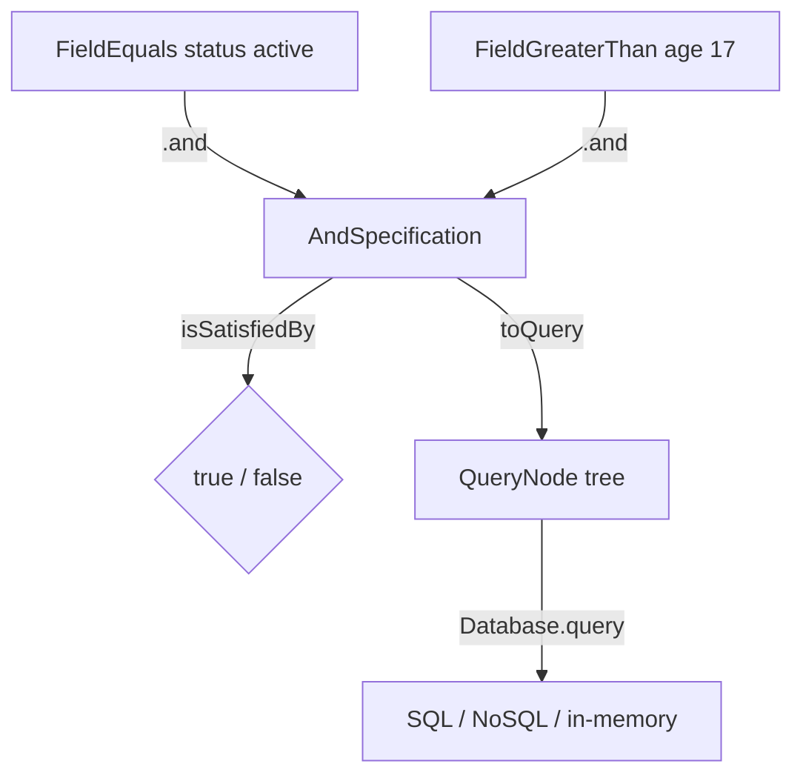

# Specification

> A composable predicate that can both filter in-memory entities and serialise to a `QueryNode` tree for database translation.

## What it is

`Specification` is an implementation of the **Specification pattern** from DDD.
It encapsulates a business rule as a reusable, composable object that answers
one question: "does this entity satisfy this criterion?"

The library provides two layers:

**`Specification<T>`** — the minimal interface, requiring only `isSatisfiedBy(entity: T): boolean`.
Use this when you only need in-memory filtering.

**`CompositeSpecification<T>`** — an abstract class that implements
`Specification<T>` and adds:
- `.and(other)` — both criteria must be satisfied
- `.or(other)` — either criterion must be satisfied
- `.not()` — the criterion must not be satisfied
- `.toQuery()` — serialises the predicate to a `QueryNode` tree

The `QueryNode` tree is the key to the pattern's power in this library. When
a [`Database`](../../infrastructure/docs/Database.md) implementation receives a
`Specification` via `database.query(store, spec)`, it calls `spec.toQuery()` to
get a structured, backend-agnostic description of the filter, then translates it
to its native query mechanism (SQL `WHERE`, MongoDB filter, in-memory predicate,
etc.). This is the **sans-I/O** principle applied to querying: domain logic
expresses *what* to find using plain value objects; infrastructure decides *how*
to find it.

Concrete specifications extend `CompositeSpecification` and implement
`isSatisfiedBy` and `toQuery`. The library ships two: `FieldEquals` and
`FieldGreaterThan`. New predicates can be added without touching existing code
— **SOLID** Open/Closed Principle.

`QueryNode` is a discriminated union of leaf nodes (`eq`, `gt`, `lt`) and
composite nodes (`and`, `or`, `not`), forming a tree that mirrors the boolean
structure of composed specifications.

## Interface

```typescript
export interface Specification<T> {
  isSatisfiedBy(entity: T): boolean
}

export abstract class CompositeSpecification<T> implements Specification<T> {
  abstract isSatisfiedBy(entity: T): boolean
  abstract toQuery(): QueryNode

  and(other: CompositeSpecification<T>): CompositeSpecification<T>
  or(other: CompositeSpecification<T>): CompositeSpecification<T>
  not(): CompositeSpecification<T>
}

// QueryNode — the serialised form
export type QueryNode
  = | { type: 'eq' | 'gt' | 'lt', field: string | number | symbol, value: Primitive }
    | { type: 'and' | 'or', nodes: QueryNode[] }
    | { type: 'not', node: QueryNode }
```

## Usage

Building and composing specifications:

```typescript
import { FieldEquals } from '@domain/Specification/implementations/FieldEquals.specification.ts'
import { FieldGreaterThan } from '@domain/Specification/implementations/FieldGreaterThan.specification.ts'

const isActive = new FieldEquals<User>('status', 'active')
const isAdult = new FieldGreaterThan<User>('age', 17)

// In-memory filtering
const spec = isActive.and(isAdult)
spec.isSatisfiedBy({ status: 'active', age: 18 }) // true
spec.isSatisfiedBy({ status: 'active', age: 16 }) // false

// Serialised to QueryNode for database translation
spec.toQuery()
// {
//   type: 'and',
//   nodes: [
//     { type: 'eq', field: 'status', value: 'active' },
//     { type: 'gt', field: 'age',    value: 17 },
//   ]
// }
```

Passing a specification to a `Database`:

```typescript
const spec = new FieldEquals('email', query.payload.email)
const results = await database.query('users', spec)
```

## Diagram



## Related

- **Implementations**: [`FieldEquals.specification.ts`](../Specification/implementations/FieldEquals.specification.ts),
  [`FieldGreaterThan.specification.ts`](../Specification/implementations/FieldGreaterThan.specification.ts)
- **Tests**: [`Specification.spec.ts`](../Specification/Specification.spec.ts),
  [`FieldEquals.specification.spec.ts`](../Specification/implementations/FieldEquals.specification.spec.ts),
  [`FieldGreaterThan.specification.spec.ts`](../Specification/implementations/FieldGreaterThan.specification.spec.ts)
- **Used by**: [`QueryHandler`](../../core/docs/QueryHandler.md),
  [`Database`](../../infrastructure/docs/Database.md)
