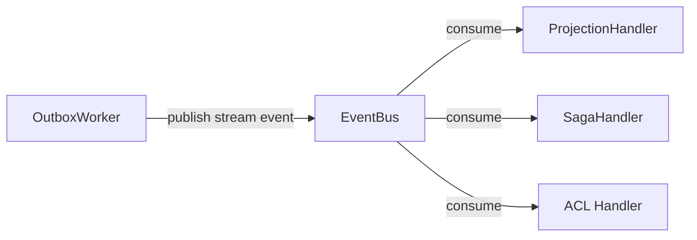

# EventBus

> Publishes events to subscribers and delivers them to registered handlers by stream.

## What it is

`EventBus` is the event-driven backbone of the infrastructure layer. It
connects event producers (the [`Outbox`](./Outbox.md), command handlers,
external adapters) to [`EventHandler`](../../core/docs/EventHandler.md)
consumers (projection handlers, saga handlers, ACL adapters) via named streams.

The interface is split into two composable sub-interfaces:

**`EventProducer`** — publishes an event to a stream:
```
publish(stream, event) → TReturnType
```

**`EventConsumer`** — subscribes handlers to a stream and delivers events to them:
```
subscribe(stream, handler) → TSubscribeReturnType
consume(stream, event)    → TConsumeReturnType
```

This separation follows the **SOLID** Interface Segregation Principle —
producers depend only on `EventProducer`, consumers depend only on
`EventConsumer`. Implementations compose both.

In `SimpleEventBus`, `publish` delegates directly to `consume`, which fans out
to all handlers subscribed on that stream in parallel via `Promise.all`. The
stream name acts as the routing key — handlers subscribe to a stream (e.g.
`'users'`) and receive all events published to it.

In **Event Sourcing / EDA**, the typical flow is:
1. `CommandHandler` saves events to the `EventStore` and enqueues them to the `Outbox`
2. `OutboxWorker` dequeues entries and calls `eventBus.publish(stream, integrationEvent)`
3. Subscribed `EventHandler`s react — updating projections, triggering sagas, etc.

Two implementations ship:
- **`SimpleEventBus`** — `Promise<void>`, throws if a handler errors
- **`ResultedEventBus`** — aggregates handler errors into a `Result`

## Interface

```typescript
export interface EventProducer<
  TEvent extends DomainEvent | IntegrationEvent | ExternalEvent,
  TReturnType = Promise<void>,
> {
  publish(stream: string, anEvent: TEvent): TReturnType
}

export interface EventConsumer<
  TEvent extends DomainEvent | IntegrationEvent | ExternalEvent,
  TEventHandler = EventHandler<TEvent>,
  TConsumeReturnType = Promise<void>,
  TSubscribeReturnType = void,
> {
  subscribe(stream: string, handler: TEventHandler): TSubscribeReturnType
  consume(stream: string, anEvent: TEvent): TConsumeReturnType
}
```

## Usage

```typescript
import { SimpleEventBus } from '@infrastructure/EventBus/implementations/SimpleEventBus.ts'

const eventBus = new SimpleEventBus<UserEvent>()
eventBus.subscribe('users', new UserCreatedEventHandler(repository))

// Publishing triggers all subscribed handlers:
await eventBus.publish('users', userCreatedEvent)
```

## Diagram



## Related

- **Implementations**: [`SimpleEventBus`](./SimpleEventBus.md),
  [`ResultedEventBus`](./ResultedEventBus.md)
- **Tests**: [`SimpleEventBus.spec.ts`](../EventBus/implementations/SimpleEventBus.spec.ts),
  [`ResultedEventBus.spec.ts`](../EventBus/implementations/ResultedEventBus.spec.ts)
- **Used by**: [`OutboxWorker`](./OutboxWorker.md),
  [`EventHandler`](../../core/docs/EventHandler.md),
  [`ScenarioTest`](./ScenarioTest.md)
- **Contrast with**: [`CommandBus`](./CommandBus.md), [`QueryBus`](./QueryBus.md)
