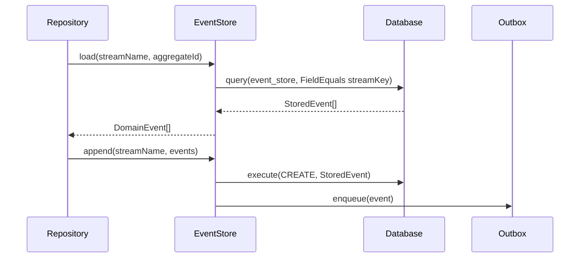

# EventStore

> The append-only ledger that persists domain events and replays them for state reconstruction.

## What it is

`EventStore` is the write-side persistence layer in **Event Sourcing**. It
stores every [`DomainEvent`](../../domain/docs/DomainEvent.md) produced by a
[`Decider`](../../domain/docs/Decider.md) as an immutable fact, and replays the
full history of an aggregate on demand so the
[`Repository`](../../domain/docs/Repository.md) can reconstruct current state.

Two operations define the interface:

- **`load(streamName, aggregateId)`** — retrieves all events for an aggregate,
  ordered by append time. The caller (typically `SimpleRepository`) folds them
  through `evolve` to arrive at the current state.
- **`append(streamName, events)`** — writes new events to the stream. All events
  in a single `append` call must belong to the same aggregate; mixing aggregates
  in one call throws `MultipleAggregatesException`.

Internally, events are wrapped in [`StoredEvent`](./StoredEvent.md) envelopes
that add a [`StreamKey`](../../utils/streamKey/docs/StreamKey.md)
(`${streamName}#${aggregateId}`), a monotonically increasing `version`, and a
write-time `timestamp`. These are stored in the underlying
[`Database`](./Database.md) and queried via a `FieldEquals` specification on
`streamKey`.

An optional [`Outbox`](./Outbox.md) can be injected into the `EventStore`. If
present, `append` automatically enqueues each event to the Outbox after writing
it — coupling the write and the outbox enqueue in a single operation. This is
the standard wiring for the Outbox pattern.

The `EventStore` interface is generic over three parameters:
- `TEvent` — the domain event union
- `TAppendReturnType` — defaults to `Promise<void>`
- `TLoadReturnType` — defaults to `Promise<TEvent[]>`

## Interface

```typescript
export interface EventStore<
  TEvent,
  TAppendReturnType = Promise<void>,
  TLoadReturnType = Promise<TEvent[]>,
> {
  load(streamName: string, aggregateId: string): TLoadReturnType
  append(streamName: string, events: TEvent[]): TAppendReturnType
}
```

## Usage

```typescript
import { SimpleEventStore } from '@infrastructure/EventStore/implementations/SimpleEventStore.ts'

const eventStore = new SimpleEventStore(database, outbox)

// Load all events for an aggregate:
const pastEvents = await eventStore.load('users', aggregateId)
const currentState = pastEvents.reduce(User.evolve, User.initialState(aggregateId))

// Append new events:
await eventStore.append('users', [userCreatedEvent])
```

## Diagram



## Related

- **Types**: [`StoredEvent`](./StoredEvent.md)
- **Implementations**: [`SimpleEventStore`](./SimpleEventStore.md),
  [`ResultedEventStore`](./ResultedEventStore.md)
- **Tests**: [`SimpleEventStore.spec.ts`](../EventStore/implementations/SimpleEventStore.spec.ts)
- **Used by**: [`Repository`](../../domain/docs/Repository.md),
  [`ScenarioTest`](./ScenarioTest.md)
