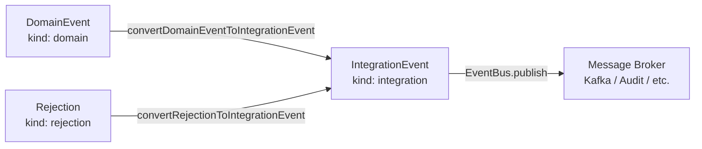

# IntegrationEvent

> The stable external envelope published to message brokers, audit logs, and external consumers.

## What it is

An `IntegrationEvent` is the outward-facing wire contract of the bounded
context. Where a [`DomainEvent`](../../domain/docs/DomainEvent.md) is an
internal fact in the event sourcing model, an `IntegrationEvent` is what leaves
the service boundary — sent to Kafka, an audit log, New Relic, or any downstream
consumer. The conversion happens via the
[`Outbox`](./Outbox.md) pattern, which uses
[`convertDomainEventToIntegrationEvent`](../../domain/docs/convertDomainEventToIntegrationEvent.md)
and
[`convertRejectionToIntegrationEvent`](../../domain/docs/convertRejectionToIntegrationEvent.md)
to produce the envelope.

Three properties make `IntegrationEvent` the right external boundary type:

**One envelope for both outcomes.** The same `IntegrationEvent` shape carries
accepted domain facts (`metadata.outcome: 'accepted'`) and rejected decisions
(`metadata.outcome: 'rejected'`). Downstream consumers subscribe once and branch
on `outcome`, rather than maintaining separate subscriptions for successes and
failures. This is a deliberate **DDD** Bounded Context boundary decision — the
internal `Rejection` type stays internal; only the integration envelope crosses
the wire.

**ISO timestamps for cross-system compatibility.** Unlike `DomainEvent` which
uses milliseconds since epoch (`number`), `IntegrationEvent.timestamp` is an
[`ISODateTime`](../../core/docs/types/ISODateTime.md) string. External systems
— especially those built on different stacks — interoperate more reliably with
ISO 8601 strings than with numeric epoch values.

**Stable, evolvable schema.** `IntegrationEventMetadata` extends
[`BaseMetadata`](../../core/docs/types/BaseMetadata.md), which carries
`schemaVersion` for forward-compatible schema evolution. Consumers can check
`schemaVersion` and adapt accordingly, following the **Open/Closed Principle**
for external contracts.

In **hexagonal architecture** terms, `IntegrationEvent` is the output port
payload: the pure data object that the infrastructure layer hands off to the
message broker adapter. It has no framework dependencies and is defined in
plain TypeScript.

## Interface

```typescript
export interface IntegrationEventMetadata extends BaseMetadata {
  outcome?: 'accepted' | 'rejected'
  aggregateType?: string
  aggregateId?: string
  commandType?: string
  commandId?: string
  expectedVersion?: number
  currentVersion?: number
}

export interface IntegrationEvent<TPayload = unknown> {
  id: string
  type: string
  payload: TPayload
  timestamp: ISODateTime
  metadata: Partial<IntegrationEventMetadata>
  kind: 'integration'
}
```

## Usage

Define a typed integration event factory (from `examples/CreateUserRejected.ts`):

```typescript
import type { IntegrationEvent, IntegrationEventMetadata } from '@infrastructure/EventBus/IntegrationEvent.ts'
import { createIntegrationEvent } from '@infrastructure/EventBus/utils/createIntegrationEvent.ts'

export interface CreateUserRejectedPayload {
  userEmail: string
}

export function createUserRejected(
  props: CreateUserRejectedPayload,
  metadata?: Partial<IntegrationEventMetadata>,
): IntegrationEvent<CreateUserRejectedPayload> {
  return createIntegrationEvent('CreateUserRejected', props, metadata)
}

export type CreateUserRejected = ReturnType<typeof createUserRejected>
```

## Diagram



## Related

- **Examples**: [`CreateUserRejected.ts`](../EventBus/examples/CreateUserRejected.ts),
  [`CreateContractSigned.ts`](../EventBus/examples/CreateContractSigned.ts),
  [`ProductCreated.ts`](../EventBus/examples/ProductCreated.ts)
- **Tests**: [`IntegrationEvent.spec.ts`](../EventBus/IntegrationEvent.spec.ts)
- **Utils**: [`createIntegrationEvent`](./createIntegrationEvent.md),
  [`isIntegrationEvent`](./isIntegrationEvent.md)
- **Used by**: [`EventBus`](./EventBus.md), [`Outbox`](./Outbox.md),
  [`OutboxWorker`](./OutboxWorker.md),
  [`ScenarioTest`](./ScenarioTest.md)
- **Contrast with**: [`DomainEvent`](../../domain/docs/DomainEvent.md),
  [`ExternalEvent`](./ExternalEvent.md)
