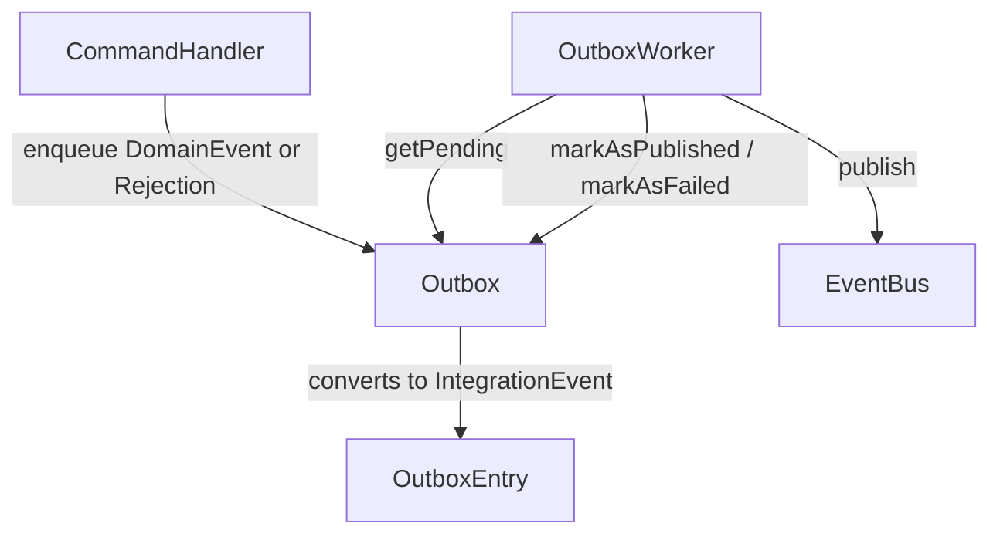

# Outbox

> At-least-once delivery buffer that converts domain events and rejections into integration events for external publishing.

## What it is

`Outbox` implements the **Transactional Outbox** pattern: rather than publishing
directly to the [`EventBus`](./EventBus.md) during a command handler (which
could fail after the write but before the publish), events are first written to
an in-process buffer (the outbox). A separate [`OutboxWorker`](./OutboxWorker.md)
then drains the buffer and publishes to the bus. This gives at-least-once
delivery guarantees and decouples domain writes from external publishing.

The `Outbox` interface has four operations:

- **`enqueue(event)`** — accepts a [`DomainEvent`](../../domain/docs/DomainEvent.md)
  or [`Rejection`](../../domain/docs/Rejection.md). The implementation
  immediately converts it to an [`IntegrationEvent`](./IntegrationEvent.md)
  (via `convertDomainEventToIntegrationEvent` or
  `convertRejectionToIntegrationEvent`) and stores it as an
  [`OutboxEntry`](./OutboxEntry.md). The conversion happens at enqueue time so
  that the outbox always holds the external wire format, ready to publish.
- **`getPending(limit?)`** — returns unpublished entries up to the given limit
  (default 100). Used by the `OutboxWorker` on each tick.
- **`markAsPublished(id)`** — flags an entry as successfully delivered.
- **`markAsFailed(id)`** — increments `retryCount` and records `lastAttemptAt`
  for retry logic.

`enqueue` is also called by [`EventStore.append`](./EventStore.md) when an
`Outbox` is injected into the store — domain writes and outbox enqueues happen
in the same synchronous call.

## Interface

```typescript
export interface Outbox<
  TEnqueueReturnType = Promise<void>,
  TGetPendingReturnType = Promise<OutboxEntry[]>,
  TMarkAsPublishedReturnType = Promise<void>,
  TMarkAsFailedReturnType = Promise<void>,
> {
  enqueue(event: DomainEvent | Rejection): TEnqueueReturnType
  getPending(limit?: number): TGetPendingReturnType
  markAsPublished(id: string): TMarkAsPublishedReturnType
  markAsFailed(id: string): TMarkAsFailedReturnType
}
```

## Usage

```typescript
import { GenericOutboxWorker } from '@infrastructure/Outbox/implementations/GenericOutboxWorker.ts'
import { InMemoryOutbox } from '@infrastructure/Outbox/implementations/InMemoryOutbox.ts'

const outbox = new InMemoryOutbox()
const worker = new GenericOutboxWorker(outbox, eventBus, 'users')

// In a CommandHandler after a rejection:
await outbox.enqueue(rejection)

// Worker drains the buffer periodically:
worker.start(1000) // runs every 1 second
```

## Diagram



## Related

- **Types**: [`OutboxEntry`](./OutboxEntry.md)
- **Worker**: [`OutboxWorker`](./OutboxWorker.md)
- **Implementation**: [`InMemoryOutbox`](./InMemoryOutbox.md)
- **Tests**: [`Outbox.spec.ts`](../Outbox/Outbox.spec.ts)
- **Used by**: [`EventStore`](./EventStore.md),
  [`CommandHandler`](../../core/docs/CommandHandler.md),
  [`ScenarioTest`](./ScenarioTest.md)
