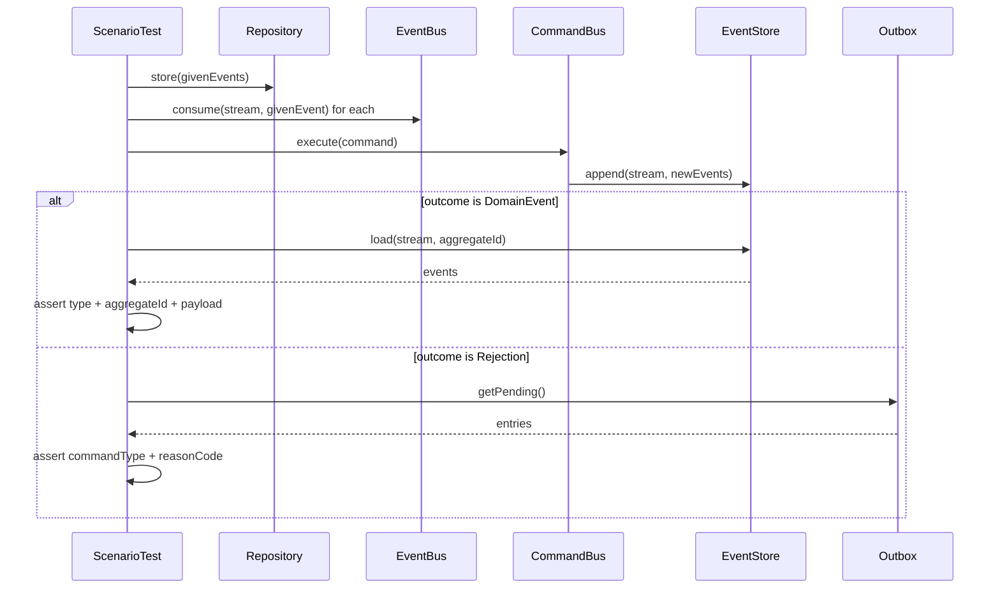
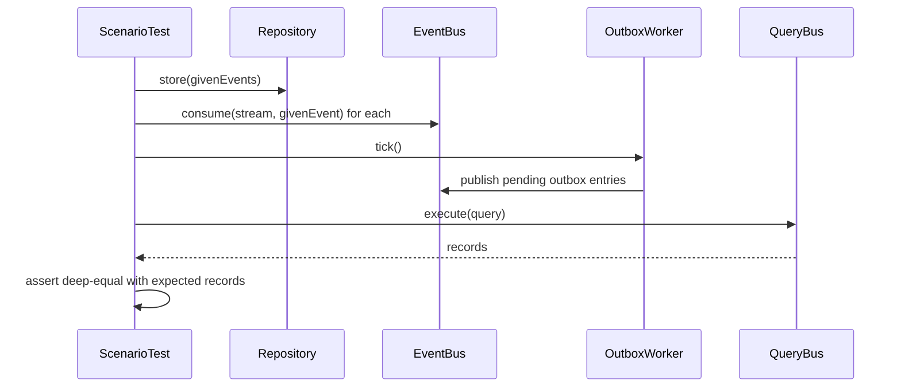
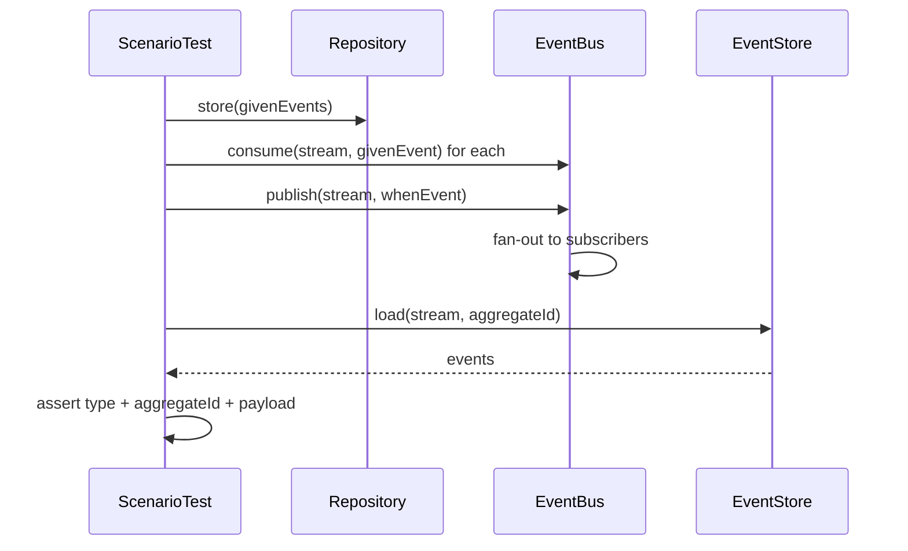

# ScenarioTest

> BDD-style test harness for event-sourced aggregates — wires the full infrastructure stack and asserts outcomes through a fluent `.given().when().then()` API.

## What it is

`ScenarioTest` is the integration point for testing the full vertical slice of a feature without
mocking individual components. It wires together every infrastructure piece — `EventStore`,
`EventBus`, `CommandBus`, `QueryBus`, `Repository`, `OutboxWorker`, and `Outbox` — and exposes
a single fluent interface that maps directly to the BDD vocabulary:

- **`given(...events)`** — seeds the aggregate's event history into the `Repository` and replays
  each event through the `EventBus` so that projections and side-effects are in the same state as
  they would be in production.
- **`when(action)`** — records the action to dispatch. Accepts a `Command`, `Query`,
  `DomainEvent`, `IntegrationEvent`, or `ExternalEvent`.
- **`then(outcome)`** — executes the `given` setup, dispatches the `when` action, and asserts the
  outcome. The assertion strategy depends on the action type (see paths below).

`given` is optional — `when(...).then(...)` works without prior history. `when` is required; an
empty `when` throws immediately in `then`.

## Three assertion paths

### Command path

`when(command)` → `then(domainEvent | Rejection)`

1. Executes the command via `commandBus.execute`.
2. If the expected outcome is a **`DomainEvent`**: loads the stream from `eventStore`, finds the
   last event matching `aggregateId` + `type`, and deep-compares `payload` via `isEqual`.
3. If the expected outcome is a **`Rejection`**: inspects `outbox.getPending()` for an entry
   whose `metadata.outcome === 'rejected'`, `commandType`, and `reasonCode` all match.

### Query path

`when(query)` → `then(records[])`

1. Ticks the `OutboxWorker` (`outboxWorker.tick()`) to flush any pending outbox entries to the
   `EventBus`, ensuring projections are up to date.
2. Executes the query via `queryBus.execute`.
3. Deep-compares the result array with the expected records via `isEqual`.

### Event path

`when(domainEvent | integrationEvent)` → `then(domainEvent)`

1. Publishes the event to the `EventBus` via `eventBus.publish`.
2. Loads the stream from `eventStore`, finds the last event matching `aggregateId` + `type`, and
   deep-compares `payload` via `isEqual`.

## Interface

```typescript
type WhenInput = Command | Query | DomainEvent | IntegrationEvent | ExternalEvent
type ThenInput = DomainEvent | Rejection | Array<Record<string, unknown>>

class ScenarioTest<TState, TEvent extends DomainEvent> {
  constructor(
    streamName: string,
    eventBus: EventProducer<DomainEvent> & EventConsumer<DomainEvent>,
    eventStore: EventStore<TEvent, Promise<void>, Promise<TEvent[]>>,
    commandBus: CommandBus<Command>,
    queryBus: QueryBus<Query, Promise<Record<string, unknown>[]>>,
    repository: Repository<DomainEvent, Promise<TState>>,
    outboxWorker: OutboxWorker,
    outbox: Outbox,
  ) {}

  given(...events: DomainEvent[]): { when(action: WhenInput): { then(outcome: ThenInput): Promise<void> }, then(outcome: ThenInput): Promise<void> } { return null! }
  when(action: WhenInput): { then(outcome: ThenInput): Promise<void> } { return null! }
  async then(outcome: ThenInput): Promise<void> {}
}
```

## Usage

```typescript
import { ScenarioTest } from '@infrastructure/ScenarioTest/ScenarioTest.ts'

const scenario = new ScenarioTest(
  'users',
  eventBus,
  eventStore,
  commandBus,
  queryBus,
  repository,
  outboxWorker,
  outbox,
)

// Command → DomainEvent
await scenario
  .given(createUserCreatedEvent(id, { name: 'Alice', email: 'alice@example.com' }))
  .when(createUpdateNameOfUserCommand(id, { name: 'Bob' }))
  .then(createUserNameUpdatedEvent(id, { name: 'Bob' }))

// Command → Rejection
await scenario
  .given(createUserCreatedEvent(id, { name: 'Alice', email: 'alice@example.com' }))
  .when(createRegisterUserCommand(id, { name: 'Alice', email: 'alice@example.com' }))
  .then({ id: randomUUID(), kind: 'rejection', type: 'CreateUserRejected', commandId: randomUUID(), commandType: 'CreateUser', reasonCode: 'ALREADY_EXISTS', timestamp: Date.now() })

// Query
await scenario
  .given(createUserCreatedEvent(id, { name: 'Alice', email: 'alice@example.com' }))
  .when(createGetUserByEmailQuery({ email: 'alice@example.com' }))
  .then([{ id, name: 'Alice', email: 'alice@example.com' }])

// Integration event triggering a command
await scenario
  .given(createUserCreatedEvent(id, { name: 'Alice', email: 'alice@example.com' }))
  .when(createContractSigned({ userId: id, product: '1' }))
  .then(createUserActivatedEvent(id, {}))
```

## Diagrams

### Command path



### Query path



### Event path



## Related

- **Tests**: [`ScenarioTest.spec.ts`](../ScenarioTest/ScenarioTest.spec.ts)
- **Used by**: Application test suites
- **Depends on**: [`EventStore`](./EventStore.md), [`EventBus`](./EventBus.md),
  [`CommandBus`](./CommandBus.md), [`QueryBus`](./QueryBus.md),
  [`Repository`](../../domain/docs/Repository.md), [`OutboxWorker`](./OutboxWorker.md),
  [`Outbox`](./Outbox.md)
