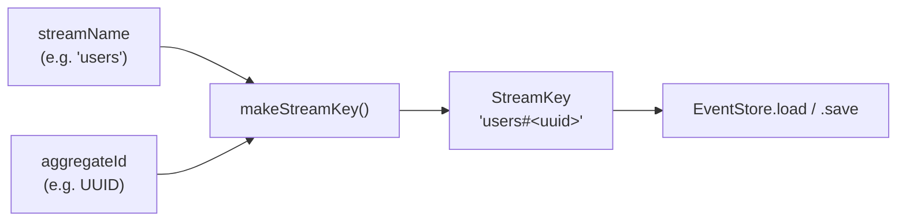

# StreamKey & makeStreamKey

> A branded string that uniquely identifies an aggregate's event stream.

## What it is

In **Event Sourcing**, every aggregate has its own ordered sequence of domain
events — its *event stream*. To load or append to that stream, the
`EventStore` needs an unambiguous key that encodes both the aggregate type
and its identity.

`StreamKey` is a TypeScript template-literal type that enforces this encoding
at the type level:

```
"users#550e8400-e29b-41d4-a716-446655440000"
 ^^^^^ ^^^^^^^^^^^^^^^^^^^^^^^^^^^^^^^^^^^^^^^
 stream name         aggregate id
```

Using a branded template literal (rather than a plain `string`) means the
compiler catches any place where a raw string is passed where a `StreamKey`
is expected. `makeStreamKey` is the single factory that produces a valid
`StreamKey` — the only way to create one.

This keeps the naming convention for event streams consistent across the
entire application (a **DRY** / **SOLID** concern) and makes the
`EventStore`'s load/append API self-documenting: if you have a `StreamKey`
in hand, you already know both the aggregate type and its id.

## Interface

```typescript
// Type
export type StreamKey = `${string}#${string}`

// Factory
export function makeStreamKey(streamName: string, aggregateId: string): StreamKey
```

## Usage

```typescript
import { makeStreamKey } from '@utils/streamKey/makeStreamKey.ts'

const key = makeStreamKey('users', user.id)
// → 'users#550e8400-e29b-41d4-a716-446655440000'

const events = await eventStore.load(key)
await eventStore.save(key, newEvents)
```

## Diagram



## Related

- **Tests**: [`makeStreamKey.spec.ts`](../makeStreamKey.spec.ts)
- **Used by**: [`EventStore`](../../../infrastructure/docs/EventStore.md),
  [`SimpleEventStore`](../../../infrastructure/docs/SimpleEventStore.md),
  [`ResultedEventStore`](../../../infrastructure/docs/ResultedEventStore.md),
  [`StoredEvent`](../../../infrastructure/docs/StoredEvent.md)
